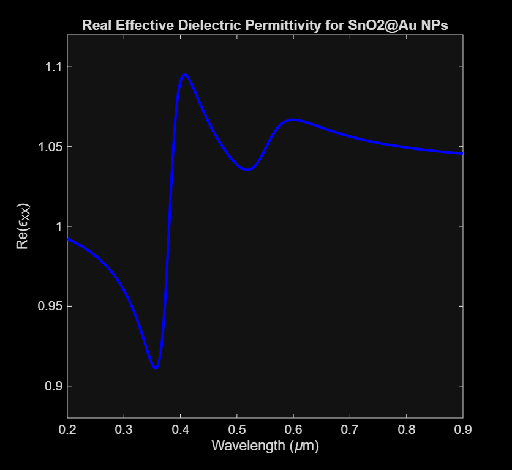

# Effective Medium Approximation Simulation
This is a program that estimates the components of the dielectric permittivity tensor of an anisotropic composite material using the Effective Medium Approximation (EMA). 
The input parameters are core radius (b), shell thickness (d), and planar number density (1/m^2) of the nanoparticles, as well as the magnitude of the magnetic flux density (B) applied to the sample.
The outputs are the components εXX and εXY of the permittivity tensor as a function of wavelength. To get the εZZ component, run the function again inputting B=0 and the output εXX=εZZ [1].
The EMA Simulation function is adapted from the Absorption Simulation function by Kenzie Lewis and Raaja Rajeshwari Manickam, based off algorithm by Dani et al. [2]

## Before running the function
Edit the EMA Simulation file to suit your needs. 
Depending on whether a single wavelength (e.g., 532 nm) or a wavelength sweep (e.g., 200 to 900 nm) is being used, comment out the irrelevant parts.
Make sure the fitted parameters (for the core - SnO2 or Fe2O3 - and Au) are up to date with the most recent experimental data.
Comment out the parameters for the type of core that's not of interest (either SnO2 or Fe2O3). Comment out the dielectric function of the effective medium that's not being used (either water or air).
All the units are SI and the angles are in radians.

## Running the simulation
Run the function in the Get EMA file. This script runs the function and formats the outputs in an excel table and plot.
   

# References
[1] T.K. Xia, P.M. Hui, and D. Stroud, “Theory of Faraday rotation in granular magnetic materials,” Journal of Applied Physics 67(6), 2736–2741 (1990). \
[2] R.K. Dani, H. Wang, S.H. Bossmann, G. Wysin, and V. Chikan, “Supplemental Material for "Faraday rotation enhancement of gold coated Fe2O3 nanoparticles: Comparison of experiment and theory," ” J. Chem. Phys. 135(22), 224502 (2011). \
[3] A. Ibrahim, “Synthesis and Characterization of Magnetic Nanoparticles to Incorporate into Silicon Waveguides to be Used as Optical Isolators,” M.S. thesis, Eng. Phys., McMaster Univ., Hamilton, Ontario, 2019. [Online]. Available: https://macsphere.mcmaster.ca/bitstream/11375/24720/2/Ibrahim_Amr_E_201908_MASc.pdf 

